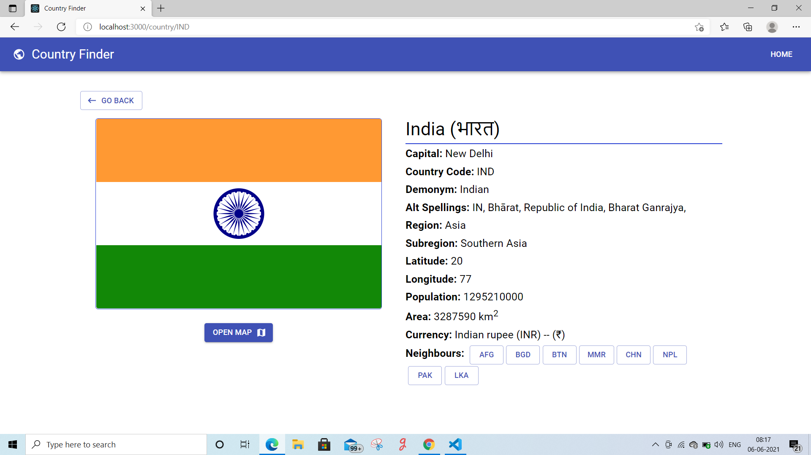
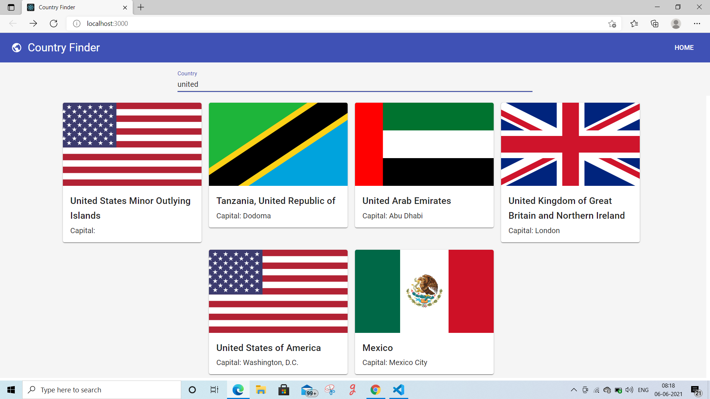
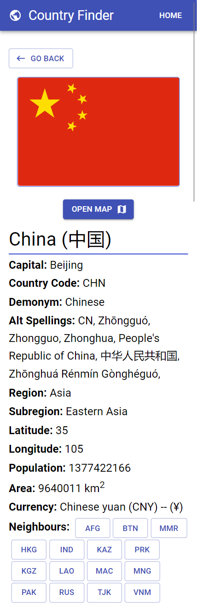

# countryFinder-nextjs-materialUi

## Set Up

> STEP:1 Clone this repository by following command

```sh
$ git clone https://github.com/jyotiprakash-m/countryFinder-nextjs-materialUi.git
$ cd countryFinder-nextjs-materialUi
```
> STEP:2 Then install all the dependencies using below command

```sh
$ npm install 

```
> STEP:3 Now you all set . To run the application use below command

```sh
$ npm start

```
## Screenshots
Some Screenshots of the project





## Live on
I host this application on vercel.com .

> [https://country-finder-nextjs-app.vercel.app](https://country-finder-nextjs-app.vercel.app/)
